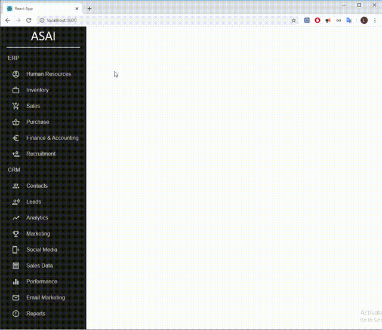

# ASAI
Repositório para disciplina Administração de Serviços e Aplicações Informáticas - IPB

Professor: Sandro Renato Dias

### FrontEnd: Updated with Sidebar, Template and Routing System.
#### Was used those imports on that update:
**npm install react-router-dom**\
**npm install @material-ui/core**\
**npm install @material-ui/icons**\

## Where do I put my code?
There are two main folders: frontend and backend.

### For frontend files
Inside the **frontend/src/pages** folder we have two more folders named: **CRM** and **ERP**, inside them you find folders with the name of the modules that must be developed. Feel free to create, update and delete files/folders inside your group's folder, but don't change files that are outside your group's folder! (ofc, package json can be modified)

### For backend files

Lucas will decide
